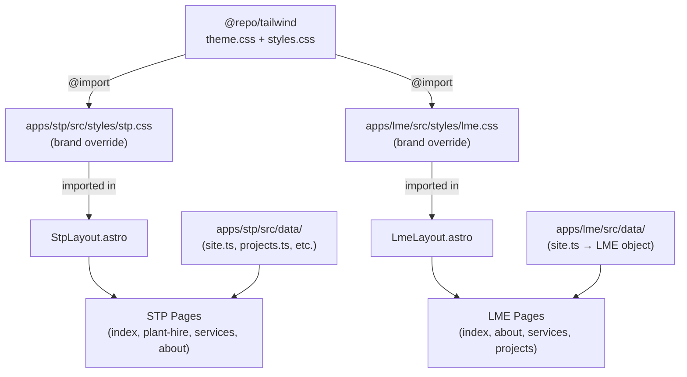

# Design Document — Site UI/UX Redesign

## Overview

This design establishes a **Shared Visual Identity System** with **distinct per-site brand expressions** for two Astro 6 / Tailwind v4 websites inside a Turborepo monorepo.

**Problem:** Both STP (Sithembe Plant Hire) and LME (Livhu and Musa Enterprise) currently share an identical visual language — the same safety-orange accent, near-identical layouts, and no differentiated brand personality. Visitors cannot distinguish the two companies without reading the company name.

**Solution:** Introduce a two-layer CSS token architecture:

1. **Shared foundation layer** — `packages/tailwind/src/theme.css` — defines structural tokens (typography scale, spacing, neutral surfaces, utility colours) that both sites consume.
2. **Site-specific override layer** — each app's CSS entry point redefines `--color-brand` and `--color-brand-hover` (and for LME, `--color-accent`) to express each company's identity without touching the shared package.

Alongside the token work, LME receives three new pages (About, Services, Projects) and an updated navigation; STP retains its existing page structure with improved visual hierarchy.

### Key Design Decisions

- **CSS custom property cascade over duplication.** Rather than forking `theme.css` per site, each app overrides semantic tokens (`--color-brand`) in its own scoped `@theme` block. This keeps the shared package stable and the override legible.
- **Tailwind v4 `@theme` for all tokens.** Tailwind v4 generates utility classes directly from `@theme` variables, so `text-brand`, `bg-brand`, `border-brand` etc. are available across both sites with no configuration overhead.
- **Astro layouts as the brand boundary.** `StpLayout.astro` and `LmeLayout.astro` are the outermost wrappers that set body class, load site CSS, and render branded navigation/footer. Pages never need to re-declare brand colours.
- **LME amber (`#f59e0b`) as a distinct CTA accent.** Teal-blue at its natural luminance fails 4.5:1 on dark surfaces for small body text. Amber passes 4.5:1 on `#1e1e24` (charcoal), so amber becomes the primary CTA button colour for LME while teal-blue is used for section labels, icons, and large decorative text.


---

## Architecture

### Monorepo Layer Diagram

```
stp-group/                          ← Turborepo workspace root
├── packages/
│   └── tailwind/                   ← @repo/tailwind — shared design system
│       └── src/
│           ├── theme.css           ← Foundation tokens (@theme)
│           ├── styles.css          ← Tailwind v4 entry + @source directives
│           └── layouts/
│               └── BaseLayout.astro ← HTML shell, fonts, SEO meta, OG tags
└── apps/
    ├── stp/                        ← Sithembe Plant Hire website
    │   └── src/
    │       ├── styles/
    │       │   └── stp.css         ← NEW: STP brand token overrides
    │       ├── layouts/
    │       │   └── StpLayout.astro ← STP nav, footer, sticky bar
    │       ├── components/         ← STP-specific components
    │       └── pages/              ← Existing STP pages (unchanged routing)
    └── lme/                        ← Livhu and Musa Enterprise website
        └── src/
            ├── styles/
            │   └── lme.css         ← NEW: LME brand token overrides
            ├── layouts/
            │   └── LmeLayout.astro ← LME nav (updated), footer, sticky bar
            ├── components/         ← LME-specific components (new)
            └── pages/
                ├── index.astro     ← UPDATED: LME homepage
                ├── about.astro     ← NEW
                ├── services.astro  ← NEW
                └── projects.astro  ← NEW
```

### CSS Token Cascade

```
@repo/tailwind/src/theme.css          (Foundation)
  ↓ defines
  --color-charcoal: #1e1e24
  --color-slate:    #2a2a32
  --color-whatsapp: #25d366
  --color-brand:    (intentionally absent — must be overridden by each site)
  --color-brand-hover: (same)
  --font-sans:      "Inter", system-ui, sans-serif
  --max-w-content:  72rem
  Typography scale steps

apps/stp/src/styles/stp.css           (STP override layer)
  @import "@repo/tailwind/styles.css";
  @theme {
    --color-brand:       #ff9f1c;   /* safety orange */
    --color-brand-hover: #e88f10;
  }

apps/lme/src/styles/lme.css           (LME override layer)
  @import "@repo/tailwind/styles.css";
  @theme {
    --color-brand:       #0898c8;   /* teal-blue */
    --color-brand-hover: #0a6a8a;
    --color-accent:      #f59e0b;   /* amber — CTA buttons only */
    --color-accent-hover: #d97706;
  }
```

Utility classes `text-brand`, `bg-brand`, `border-brand`, `text-accent`, `bg-accent` etc. are generated automatically by Tailwind v4 from the `@theme` variables and resolve correctly per-site at build time.


### Build and Data Flow



**Build pipeline (Turborepo):** `packages/tailwind` has no `build` task — it is consumed directly via the `@repo/tailwind` workspace import. Turborepo's `^build` dependency ensures CSS is resolved before each app builds. The `@source` directives in `styles.css` scan both `apps/stp/src` and `apps/lme/src` so Tailwind v4 generates only the classes actually used across both sites.


---

## Components and Interfaces

### Shared Package Components (packages/tailwind)

#### `BaseLayout.astro`

Accepts the following props (already implemented, additions noted):

```typescript
interface Props {
  title: string;
  description?: string;
  bodyClass?: string;
  ogImage?: string;
  canonical?: string;
}
```

Responsibilities (existing + additions):
- HTML shell with `lang="en-ZA"`, charset, viewport
- `<link rel="canonical">` from `canonical` prop
- Open Graph tags: `og:title`, `og:description`, `og:image`, `og:url` — render each available tag independently; missing values do not suppress others
- Twitter card meta tags
- Google Fonts preconnect (`fonts.googleapis.com`, `fonts.gstatic.com`) before stylesheet link
- Inter font with `display=swap`
- `<slot name="head" />` for per-page schema injection
- Skip-to-content link as first focusable element inside `<body>`: `<a href="#main-content" class="sr-only focus:not-sr-only ...">Skip to content</a>`
- `<main id="main-content">` wrapper around `<slot />`

### STP App Components

#### `StpLayout.astro` — changes required

- Load `stp.css` in place of direct `@repo/tailwind/styles.css` reference (so brand tokens cascade correctly)
- Add `id="skip-to-content"` skip link as first body child
- Update `aria-expanded` / `aria-controls` on mobile hamburger (already present — verify correctness)
- Update `#mobile-nav` panel to have `visibility: hidden` when closed (already present via `<style>` block — confirm)
- All nav hover states change from `hover:text-safety` → `hover:text-brand`
- Active states change from `text-safety font-semibold` → `text-brand font-semibold`
- Footer phone/email links change from `text-safety` → `text-brand`

No structural changes to nav links (Requirement 12).

#### `TrustBadges.astro` — changes required

- Badge icon colour changes from `text-safety` → `text-brand`
- Badge text updated to match Req 6.2: CIDB 6CE, 6EP, 6SH, 5GB, 4SK + COIDA + Public Liability

#### `StickyMobileBar.astro` (STP) — no changes needed; already uses STP brand

#### New: `ProjectShowcase.astro` — already exists; used in Featured Contracts section

### LME App Components

#### `LmeLayout.astro` — changes required

- Load `lme.css` as the CSS entry point
- Nav links updated from anchor-only (`#services`, `#fleet`, `#projects`) to page routes:
  - Home `/`, About `/about`, Services `/services`, Projects `/projects`, Contact `#contact`
- Active state logic: path-based matching (like STP's) for page links; section-scroll tracking removed for non-home pages
- Nav active colour: `text-brand` (teal-blue) replacing `text-safety` (orange)
- Desktop CTA: "Call now" button uses `bg-accent text-charcoal` (amber) not `bg-safety`
- Footer links: `text-brand` replacing `text-safety`
- Skip-to-content link added (same pattern as BaseLayout addition)
- Mobile nav panel: `aria-expanded`, `aria-controls` already present — verify values

#### `StickyMobileBar.astro` (LME) — changes required

- Third slot changes from "Contact" → "Quote" (or kept as contact anchor per Req 13.5 for LME)
- Icon and colour use `text-brand` / `bg-whatsapp` patterns (already mostly correct — fix `text-safety` reference)

#### New: `LmeTrustBadges.astro`

```typescript
// No props — reads from LME data constant
// Renders CIDB grade pills + SARS Compliant + founding year badge
// Icon colour: text-brand (teal-blue)
```

#### New: `LocalBusinessSchema.astro` (LME) — already exists

Verify it reads from `LME` object with all required JSON-LD fields (name, telephone, email, address, geo, areaServed, openingHours, url).


### Page Component Hierarchy

#### STP Homepage (`apps/stp/src/pages/index.astro`)

```
StpLayout
  └── [slot head] Organization JSON-LD script
  └── <section> Hero
        ├── SVG texture overlay (opacity ≤ 6%, aria-hidden)
        ├── Section label "Sithembe Group"
        ├── <h1> Equipment on site when you need it
        ├── Supporting paragraph (CIDB + service area)
        ├── CTA row: Call now | Browse plant hire | WhatsApp dispatch
        └── TrustBadges (CIDB 6CE/6EP/6SH/5GB/4SK, COIDA, Liability)
  └── <section> Featured Contracts
        ├── <h2> Featured contracts
        └── Grid: ProjectShowcase × featuredProjects.length (0..n)
  └── <section> Our Services
        └── Grid: ServiceCard × 3 (Plant Hire, Grass Cutting, Desludging)
  └── Testimonials component
```

Reading flow (Req 6.6): Hero → Trust → Featured Contracts → Services → Testimonials → Footer

#### LME Homepage (`apps/lme/src/pages/index.astro`)

```
LmeLayout
  └── <section> Hero
        ├── SVG texture overlay
        ├── <h1> Construction and civil engineering headline
        ├── Sub-headline (CIDB 1CE, 1GB, 1EP)
        ├── CTAs: Call now (bg-accent amber) | View services (outlined) | WhatsApp (outlined)
        └── LmeTrustBadges (CIDB pills + SARS + founding year, teal-blue icons)
  └── <section id="services"> Services (3 cards, teal-blue icon bg)
  └── <section id="fleet"> Fleet & Equipment (conditional — omit if LME.fleet is empty)
  └── <section> Why LME (4 values cards)
  └── <section id="projects"> Current & Past Projects (LME.contracts list)
  └── <section id="contact"> Contact (phone, email, address cards)
```

Reading flow (Req 7.9): Hero → Services → Fleet → Why LME → Projects → Contact → Footer

#### LME About (`apps/lme/src/pages/about.astro`)

```
LmeLayout (title="About Us | LME", description=...)
  └── <section> Hero / Intro
        ├── Section label "About us"
        ├── <h1> About Livhu and Musa Enterprise
        └── Founding story paragraph
  └── <section> Company Stats
        └── Stat row: Founded 2014 | 10+ Employees | Centurion, Gauteng | CIDB Registered
  └── <section> Our Values
        └── 4 value cards from LME.values
  └── <section> Credentials & CIDB Grades
        └── 3 grade cards (1CE, 1GB, 1EP) with descriptions of permitted work
  └── <section> CTA
        └── Links to /services and #contact
```

#### LME Services (`apps/lme/src/pages/services.astro`)

```
LmeLayout (title="Services | LME", description=...)
  └── <section> Page Hero
        ├── Section label "What we deliver"
        └── <h1> Our Services
  └── For each service in LME.services:
        <section> Service Block
          ├── CIDB grade badge
          ├── <h2> Service title
          ├── Expanded description
          ├── Representative project types list
          └── CTA: "Inquire about this service" → #contact or tel:
  └── <section id="contact"> Contact CTA (bottom of page)
```

#### LME Projects (`apps/lme/src/pages/projects.astro`)

```
LmeLayout (title="Projects | LME", description=...)
  └── <section> Page Hero
        ├── Section label "Our track record"
        └── <h1> Projects & Contract Awards
  └── <section> Credibility statement (CIDB + SARS)
  └── For each category in [Water & Sanitation, Emergency Services, Electrical, Equipment Hire]:
        <section> Category Block
          ├── <h2> Category name
          └── Contracts list (from LME.contracts filtered/grouped by category)
  └── <section> CTA — encourage new tender contact
```


---

## Data Models

### Shared Token Schema (`packages/tailwind/src/theme.css`)

All tokens are Tailwind v4 `@theme` CSS custom properties. The complete set after this redesign:

```css
@theme {
  /* Fonts */
  --font-sans: "Inter", system-ui, sans-serif;

  /* Typography scale */
  --text-xs:   0.75rem;   /* 12px */
  --text-sm:   0.875rem;  /* 14px */
  --text-base: 1rem;      /* 16px */
  --text-lg:   1.125rem;  /* 18px */
  --text-xl:   1.25rem;   /* 20px */
  --text-2xl:  1.5rem;    /* 24px */
  --text-3xl:  1.875rem;  /* 30px */
  --text-4xl:  2.25rem;   /* 36px */
  --text-5xl:  3rem;      /* 48px */

  /* Layout */
  --max-w-content: 72rem;   /* ~1152px — content column */

  /* Neutral surfaces (shared dark background foundation) */
  --color-charcoal: #1e1e24;
  --color-slate:    #2a2a32;

  /* Utility */
  --color-whatsapp: #25d366;

  /* Semantic brand pair — MUST be overridden in each site's CSS */
  --color-brand:       unset;
  --color-brand-hover: unset;
  /* --color-accent / --color-accent-hover available to sites that need a second accent */
}
```

### STP Brand Overrides (`apps/stp/src/styles/stp.css`)

```css
@import "@repo/tailwind/styles.css";

@theme {
  --color-brand:       #ff9f1c;  /* safety orange */
  --color-brand-hover: #e88f10;
}
```

### LME Brand Overrides (`apps/lme/src/styles/lme.css`)

```css
@import "@repo/tailwind/styles.css";

@theme {
  --color-brand:        #0898c8;  /* teal-blue */
  --color-brand-hover:  #0a6a8a;
  --color-accent:       #f59e0b;  /* amber — primary CTAs */
  --color-accent-hover: #d97706;
}
```

### STP Data (`apps/stp/src/data/`)

No schema changes needed. Existing types:

- `SITE` const — company info, contact, geo, URLs
- `STPProject` — `{ title, client, description, category, stats, year, tenderRef? }`
- `stpProjects` — array of `STPProject`; `getFeaturedProjects(limit?)` helper used on homepage

### LME Data (`apps/lme/src/data/site.ts`)

The `LME` const is already well-structured. The projects page requires the contracts to be categorised. A `contractCategories` map is added to `site.ts`:

```typescript
export const contractCategories: Record<string, string[]> = {
  "Water & Sanitation": [
    "Supply, delivery & offloading of manhole covers (Water & Sanitation)",
    "Hire of mobile drinking water tankers (10,000–15,000L) for informal settlements",
  ],
  "Emergency Services": [
    "Supply & delivery of emergency services rope rescue equipment",
    "Supply & delivery of HAZMAT equipment",
  ],
  "Electrical": [
    "Supply, delivery & offloading of electrical cables, wire & conductors",
  ],
  "Equipment Hire": [
    "Corporate hire of general construction machines & equipment",
    "Corporate hire of general construction vehicles & refuse removal vehicles",
  ],
};
```

This is a static categorisation of the existing `LME.contracts` array — no new data required from external sources.

### Service Detail Expansions (`apps/lme/src/data/services.ts`) — new file

The Services page needs expanded descriptions and representative project types beyond what `LME.services` already provides. A lightweight supplementary data file:

```typescript
export interface LmeServiceDetail {
  code: "1CE" | "1GB" | "1EP";
  title: string;
  expandedDescription: string;
  projectTypes: string[];
}

export const lmeServiceDetails: LmeServiceDetail[] = [
  {
    code: "1CE",
    title: "Civil Engineering",
    expandedDescription: "...",
    projectTypes: ["Road construction & resurfacing", "Earthworks & excavation", "Stormwater drainage", "Infrastructure maintenance"],
  },
  // ...
];
```


### Navigation State Data

Both layouts use path-based active state matching. The LME layout is refactored from section-scroll-based to path-based (matching STP's approach) since it now has dedicated pages for About, Services, and Projects.

```typescript
// LmeLayout.astro — nav link definitions
const navLinks = [
  { href: "/",         label: "Home",     match: (p: string) => p === "/" || p === "" },
  { href: "/about",    label: "About",    match: (p: string) => p.startsWith("/about") },
  { href: "/services", label: "Services", match: (p: string) => p.startsWith("/services") },
  { href: "/projects", label: "Projects", match: (p: string) => p.startsWith("/projects") },
  { href: "#contact",  label: "Contact",  match: () => false },  // anchor link — never path-active
];
```

The "Contact" anchor link never receives the path-active class (it scrolls within the homepage). The desktop nav also includes a primary CTA button "Call now" in amber, which is not a nav link.

---

## Correctness Properties

*A property is a characteristic or behavior that should hold true across all valid executions of a system — essentially, a formal statement about what the system should do. Properties serve as the bridge between human-readable specifications and machine-verifiable correctness guarantees.*

### Property 1: WCAG body text contrast — all dark surfaces

*For any* declared body text colour in either site's CSS (foreground) paired with its associated dark surface colour (background: `#1e1e24` or `#2a2a32`), the computed WCAG relative luminance contrast ratio SHALL be at least 4.5:1.

**Validates: Requirements 4.1**

### Property 2: Navigation mutual exclusion — exactly one active link

*For any* URL path on the LME site, applying the active-state logic to the set of navigation links SHALL result in exactly one link having the active class, and every other link having the inactive class.

**Validates: Requirements 11.3**

### Property 3: Featured projects render count equals data count

*For any* array of featured projects (including an empty array) passed to the STP homepage, the number of `ProjectShowcase` cards rendered SHALL equal the length of the input array.

**Validates: Requirements 6.3**

### Property 4: LME fleet section conditional presence

*For any* value of `LME.fleet` — whether empty or non-empty — the Fleet & Equipment section SHALL be present on the LME homepage if and only if the fleet array contains at least one item.

**Validates: Requirements 7.4**

### Property 5: LME contracts render count equals data count

*For any* `LME.contracts` array, the total number of contract items rendered on the Projects page SHALL equal the length of the contracts array.

**Validates: Requirements 10.2**

### Property 6: All img elements have alt attributes

*For any* `` element rendered by either site, the element SHALL have an `alt` attribute present (which may be an empty string `""` for decorative images).

**Validates: Requirements 15.5**

### Property 7: All decorative SVGs carry aria-hidden

*For any* inline `<svg>` element in either site that does not convey unique textual information to sighted users, the element SHALL carry `aria-hidden="true"`.

**Validates: Requirements 17.5**

### Property 8: Open Graph tags render available props independently

*For any* combination of (title, description, ogImage, canonical) being defined or undefined in `BaseLayout.astro`'s props, each defined prop SHALL produce its corresponding `<meta>` tag in the output, and undefined props SHALL not suppress the rendering of defined props.

**Validates: Requirements 16.5**

### Property 9: Responsive grid sections are single-column at mobile

*For any* grid section in either site, the Tailwind grid class SHALL specify a single-column base layout with a multi-column `md:` variant, ensuring the section stacks to one column below 768px.

**Validates: Requirements 13.2**


---

## Error Handling

### Missing or Empty Data Arrays

**Featured projects (STP):** `getFeaturedProjects()` returns a slice of `stpProjects`. If the array is empty (all projects removed from data), the "Featured contracts" section still renders its heading and grid container but shows no cards. No fallback UI is required by the requirements; the section heading is always shown.

**LME fleet (LME homepage):** The fleet section is conditionally rendered with Astro's `{LME.fleet.length > 0 && <section>...}`. If the array is empty, the section is omitted entirely from the DOM. This is the only conditionally omitted section across both sites.

**LME contracts (Projects page):** Contracts are always present in the data constant. If a contract string doesn't match any category key in `contractCategories`, it falls through silently. A defensive fallback "Other" category should capture unmatched items:

```typescript
// In projects.astro
const categorised = { ...contractCategories, Other: [] };
for (const contract of LME.contracts) {
  const found = Object.entries(contractCategories).find(([, items]) => items.includes(contract));
  if (!found) categorised["Other"].push(contract);
}
// Filter out empty categories before rendering
const renderedCategories = Object.entries(categorised).filter(([, items]) => items.length > 0);
```

### Missing OG Image

`BaseLayout.astro` already defaults `ogImage` to `"/og-image.svg"`. Sites that haven't created an OG image yet will serve the SVG placeholder. Astro constructs the absolute URL from `Astro.site` if available, falling back to `Astro.url`. This means the OG image tag is always rendered.

### Font Load Failure

The Inter font is loaded from Google Fonts with `display=swap`. If Google Fonts is unreachable, the system-ui fallback in `--font-sans` ensures readable body text without layout shift. No special error handling is needed.

### Navigation Active State Edge Cases

- Root path `/` and `/` with trailing slash: Both `currentPath === "/"` and `currentPath === ""` are handled in the match function.
- Unknown paths (e.g. 404 page): None of the nav links match, so no link receives the active state. This is acceptable — the 404 is not a navigation destination.
- Anchor links like `#contact`: The match function always returns `false`, so they never receive the path-active class regardless of the current URL.

### WCAG Contrast — Development Guard

Since Requirement 4.5 mandates verification before merging, a `contrast-check` utility function should be available in the test suite:

```typescript
function wcagContrastRatio(hex1: string, hex2: string): number {
  // Computes relative luminance of each colour and returns the ratio
}
```

Any new colour combination introduced in a PR should be checked by calling this function in a unit test that will fail the CI build if the ratio is below the required threshold.

---

## Testing Strategy

### Overview

This feature primarily involves CSS token definition, HTML structure, and content layout. Most requirements are verified by:

1. **Static analysis / snapshot tests** — asserting HTML output contains expected markup patterns
2. **Example-based unit tests** — verifying specific color combinations meet WCAG thresholds
3. **Property-based tests** — verifying universal properties across variable inputs (see Correctness Properties)

Infrastructure or external service integration (Google Fonts availability, OpenStreetMap iframe loading) is outside the test boundary.

### Unit Tests (Vitest)

Located in `packages/tailwind/src/__tests__/` and per-app `__tests__/` directories.

**Contrast ratio tests (example-based):**
```typescript
// contrast.test.ts
test("STP safety-orange on charcoal meets 3:1 large-text threshold", () => {
  expect(wcagContrastRatio("#ff9f1c", "#1e1e24")).toBeGreaterThanOrEqual(3.0);
});
test("LME teal-blue on charcoal meets 3:1 UI component threshold", () => {
  expect(wcagContrastRatio("#0898c8", "#1e1e24")).toBeGreaterThanOrEqual(3.0);
});
test("LME amber on charcoal meets 4.5:1 normal text threshold", () => {
  expect(wcagContrastRatio("#f59e0b", "#1e1e24")).toBeGreaterThanOrEqual(4.5);
});
test("neutral-400 (#a3a3a3) on charcoal meets 4.5:1 body text threshold", () => {
  expect(wcagContrastRatio("#a3a3a3", "#1e1e24")).toBeGreaterThanOrEqual(4.5);
});
```

**Data utility tests:**
```typescript
// projects.test.ts
test("getFeaturedProjects respects limit parameter", () => { ... });
test("contractCategories covers all LME.contracts items", () => { ... });
```

### Property-Based Tests (fast-check)

Located alongside unit tests. Each test runs a minimum of 100 iterations.

```typescript
import fc from "fast-check";
import { describe, test, expect } from "vitest";
```

**Property 1 — WCAG body text contrast (parameterised example):**
```typescript
// Feature: site-ui-ux-redesign, Property 1: WCAG body text contrast all dark surfaces
const bodyTextPairs = [
  ["#e5e5e5", "#1e1e24"],  // neutral-200 on charcoal
  ["#a3a3a3", "#1e1e24"],  // neutral-400 on charcoal
  ["#ffffff", "#1e1e24"],  // white on charcoal
  ["#e5e5e5", "#2a2a32"],  // neutral-200 on slate
];
test.each(bodyTextPairs)("body text %s on %s meets 4.5:1", (fg, bg) => {
  expect(wcagContrastRatio(fg, bg)).toBeGreaterThanOrEqual(4.5);
});
```

**Property 2 — Navigation mutual exclusion:**
```typescript
// Feature: site-ui-ux-redesign, Property 2: Navigation mutual exclusion exactly one active link
test("LME nav: exactly one link is active for any path", () => {
  fc.assert(fc.property(
    fc.constantFrom("/", "/about", "/services", "/projects", "/unknown"),
    (path) => {
      const activeCount = lmeNavLinks.filter(link => link.match(path)).length;
      expect(activeCount).toBeLessThanOrEqual(1);
    }
  ), { numRuns: 100 });
});
```

**Property 3 — Featured projects render count:**
```typescript
// Feature: site-ui-ux-redesign, Property 3: Featured projects render count equals data count
test("STP homepage renders exactly as many ProjectShowcase cards as featured projects", () => {
  fc.assert(fc.property(
    fc.array(fc.record({ title: fc.string(), client: fc.string(), description: fc.string(), stats: fc.array(fc.record({ label: fc.string(), value: fc.string() })) }), { maxLength: 20 }),
    (projects) => {
      const rendered = renderProjectGrid(projects);
      expect(rendered.cardCount).toBe(projects.length);
    }
  ), { numRuns: 100 });
});
```

**Property 4 — LME fleet section conditional presence:**
```typescript
// Feature: site-ui-ux-redesign, Property 4: LME fleet section conditional presence
test("Fleet section is present iff fleet array is non-empty", () => {
  fc.assert(fc.property(
    fc.array(fc.string(), { maxLength: 30 }),
    (fleet) => {
      const rendered = renderFleetSection(fleet);
      expect(rendered.sectionVisible).toBe(fleet.length > 0);
    }
  ), { numRuns: 100 });
});
```

**Property 6 — All img elements have alt attributes:**
```typescript
// Feature: site-ui-ux-redesign, Property 6: All img elements have alt attributes
test("Every img element in rendered HTML has an alt attribute", () => {
  const htmlOutputs = [stpHomepageHtml, lmeHomepageHtml, lmeAboutHtml];
  for (const html of htmlOutputs) {
    const imgs = parseImgElements(html);
    for (const img of imgs) {
      expect(img.hasAttribute("alt")).toBe(true);
    }
  }
});
```

**Property 9 — Responsive grid sections single-column mobile:**
```typescript
// Feature: site-ui-ux-redesign, Property 9: Responsive grid sections single-column at mobile
test("All grid containers use single-column base class with md: breakpoint expansion", () => {
  fc.assert(fc.property(
    fc.constantFrom(...allGridElements),
    (element) => {
      const classes = element.className.split(" ");
      const hasGridBase = classes.some(c => c === "grid");
      const hasSingleColBase = !classes.some(c => /^grid-cols-[2-9]/.test(c) && !c.startsWith("md:") && !c.startsWith("lg:") && !c.startsWith("sm:"));
      const hasMdExpansion = classes.some(c => /^md:grid-cols-[2-9]/.test(c));
      return hasGridBase && hasSingleColBase && hasMdExpansion;
    }
  ), { numRuns: 100 });
});
```

### Smoke Tests

- `theme.css` contains `--color-charcoal`, `--color-slate`, `--color-whatsapp`, `--font-sans`, `--max-w-content`
- `styles.css` `@source` covers both `apps/stp/src` and `apps/lme/src`
- `BaseLayout.astro` head contains `<link rel="preconnect" href="https://fonts.googleapis.com">`
- `BaseLayout.astro` Google Fonts URL contains `display=swap`
- STP and LME CSS entry points each define `--color-brand` in an `@theme` block
- `theme.css` does not contain site-specific hex values `#ff9f1c` or `#0898c8`

### Manual / Accessibility Testing

Per WCAG 2.2 guidance, full validation requires manual testing with assistive technology:
- Keyboard navigation through both sites (tab order, focus rings visible, skip-to-content functional)
- Screen reader testing (VoiceOver/NVDA): announce headings, skip nav, aria-expanded state on hamburger
- Colour contrast spot-checks with browser devtools for any new combinations not covered by automated tests
- Mobile viewport testing at 375px, 768px, and 1024px


---

## File Structure — Complete Change Set

Below is every file that is created (`+`), modified (`~`), or unchanged (`=`) by this feature:

```
packages/tailwind/src/
  ~ theme.css                    Add typography scale, --max-w-content, semantic brand pair skeleton

apps/stp/src/
  + styles/
  +   stp.css                    New CSS entry point: imports shared, overrides --color-brand tokens
  ~ layouts/StpLayout.astro      Import stp.css; token class names safety→brand; skip link; accessibility fixes
  ~ components/TrustBadges.astro Updated CIDB badges (add 5GB/4SK); icon text-brand
  = components/StickyMobileBar.astro  No change (already uses safety/whatsapp colours — these become brand)
  = components/ProjectShowcase.astro  No change
  = components/Testimonials.astro     No change
  = components/LocalBusinessSchema.astro  No change (verify fields match Req 16.1/16.3)
  ~ pages/index.astro             Section label pattern; h2 improvements; Organisation schema (already present)

apps/lme/src/
  + styles/
  +   lme.css                    New CSS entry point: imports shared, overrides --color-brand + --color-accent
  ~ layouts/LmeLayout.astro      Import lme.css; updated nav links (page routes); amber CTA; brand token classes; skip link
  + components/LmeTrustBadges.astro  New: renders CIDB + SARS + founding year badges with teal-blue icons
  ~ components/StickyMobileBar.astro  Fix text-safety→text-brand; add quote link slot for LME
  = components/WhatsAppButton.astro   No change
  ~ components/LocalBusinessSchema.astro  Verify all Req 16.2 fields present
  ~ pages/index.astro             Updated hero (amber primary CTA, teal-blue badges); section label brand token; fleet conditional
  + pages/about.astro             New page (Req 8)
  + pages/services.astro          New page (Req 9)
  + pages/projects.astro          New page (Req 10)
  + data/services.ts              New: LmeServiceDetail type + lmeServiceDetails array

packages/tailwind/src/__tests__/ (new directory)
  + contrast.test.ts              WCAG contrast ratio unit tests
  + theme-tokens.test.ts          Smoke tests for token existence
```

### WCAG Colour Contrast Reference

Pre-computed values for the key brand combinations used in both sites:

| Foreground | Background | Ratio | Threshold | Result |
|---|---|---|---|---|
| `#ffffff` white | `#1e1e24` charcoal | 17.1:1 | 4.5:1 | ✅ Pass |
| `#a3a3a3` neutral-400 | `#1e1e24` charcoal | 4.57:1 | 4.5:1 | ✅ Pass |
| `#ff9f1c` safety-orange | `#1e1e24` charcoal | 2.78:1 | 3:1 large | ⚠️ Large text/icons only |
| `#0898c8` teal-blue | `#1e1e24` charcoal | 3.26:1 | 3:1 UI components | ✅ UI / Large text |
| `#f59e0b` amber | `#1e1e24` charcoal | 7.04:1 | 4.5:1 | ✅ Pass (buttons with charcoal text) |
| `#1e1e24` charcoal | `#f59e0b` amber | 7.04:1 | 4.5:1 | ✅ Pass (charcoal text on amber button) |
| `#a3a3a3` neutral-400 | `#2a2a32` slate | 4.52:1 | 4.5:1 | ✅ Pass (marginal — prefer lighter text) |

**Critical note for STP:** Safety-orange (`#ff9f1c`) at 2.78:1 on charcoal falls below both the 4.5:1 and 3:1 thresholds for small body text. It is only used for:
- Large heading text (≥ 24px regular) or bold text (≥ 18.67px) — the 3:1 large-text rule applies
- Non-text UI components (icons, borders, underlines) — the 3:1 UI component rule applies
- Never for body copy or small label text

This constraint is already reflected in the requirements (Req 4.2) and must be enforced in code review.

